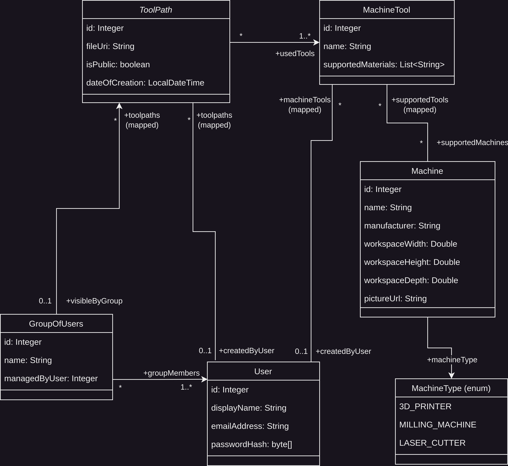
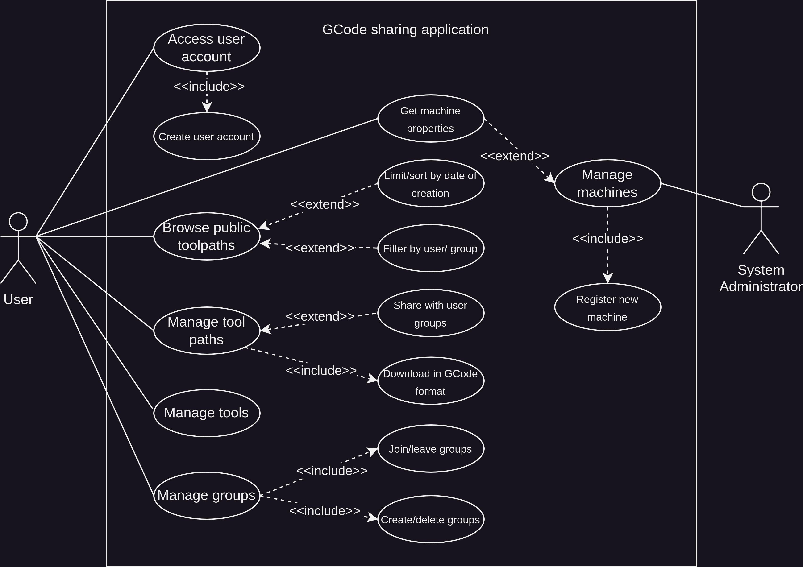

# Introduction

The purpose of this project is to develop a tool path management application for
various CNC (computer numerical control) machines, such as 3D printers, laser
cutters, and milling machines. In the field of Computer-aided Manufacturing (CAM), a
tool path is a set of instructions that describe the operations to perform on the
machine, such as moving to specific locations or changing tools. Tool paths are
typically written in Gcode, a universally interpretable programming language for
CNC machine controller hardware.

# How to run?

Set up a PostgreSQL database and provide the database URL and credentials in application.yml.
Make sure to have proper read/write permissions for the "upload" directory, where GCode files
will be stored (uploaded by the client).

Swagger documentation is available at <host>/v3/api-docs and <host>/swagger-ui/index.html after
starting the application.

# Functional aspects

## Data model

## Use cases

# Endpoints
| Endpoint                                                             | Path & Params                                                                             | Method |Description|
|----------------------------------------------------------------------|-------------------------------------------------------------------------------------------|--------|---|
| /toolpaths                                                           | ?created-after=<date>&created-before=<date>&sort=<ascend\|descend>&limit=<int>&page=<int> | GET    |Get public tool paths, additionally filtering by date (sortable).|
|                                                                      | /{toolpath_id}/gcode                                                                      | GET    |Retrieve tool path in GCode format.|
|                                                                      |                                                                                           | POST   |Create a new tool path.|
|                                                                      | /{toolpath_id}                                                                            | DELETE |Delete an existing tool path.|
| /tools                                                               | ?name=<string>&supported-materials=<string>&supported-by-machines=<string>                | GET    |List tools, additionally filtering by the name, supported materials, and machines.|
|                                                                      |                                                                                           | POST   |Create a new tool.|
|                                                                      | /{tool_id}                                                                                | DELETE |Delete an existing tool.|
| /machines                                                            | ?manufacturer=<string>&name=<string>&sort=<ascend\|descend>&limit=<int>&page=<int>        | GET    |Get machines, additionally filtering by the name and manufacturer.|
|                                                                      | /{machine-id}/picture                                                                     | GET    |Get a picture of the machine.|
|                                                                      | /{machine-id}/tools                                                                       | GET    |Get supported tools for the machine.|
|                                                                      | /{machine-id}                                                                             | POST   |Create a machine.|
| /groups | ?name=<string>&sort=<ascend\|descend>&limit=<int>&page=<int>                              |  GET   | List groups, additionally filtering by the name. |
|                                                                      |                                                                                           | POST   |Create a new group.|
|                                                                      | /{group_id}                                                                               | PATCH  |Join/leave an existing group.|
|                                                                      | /{group_id}                                                                               | DELETE |Delete an existing group.|
|                                                                      | /{group_id}/members                                                                       | GET    |List the users of a group.|
|                                                                      | /{group_id}/toolpaths                                                                     | GET    |List group-visible tool paths.|
| /users                                                               | /{user_id}                                                                                | GET    |Get user information.|
|                                                                      | /{user_id}/toolpaths                                                                      | GET    |List tool paths created by a user.|
|                                                                      | /{user_id}/tools                                                                          | GET    |List tools created by a user.|
| /signup                                                              |                                                                                           | POST   |Register a new user.|
| /metrics                                                             |                                                                                           | GET    |Get high-level metrics.|